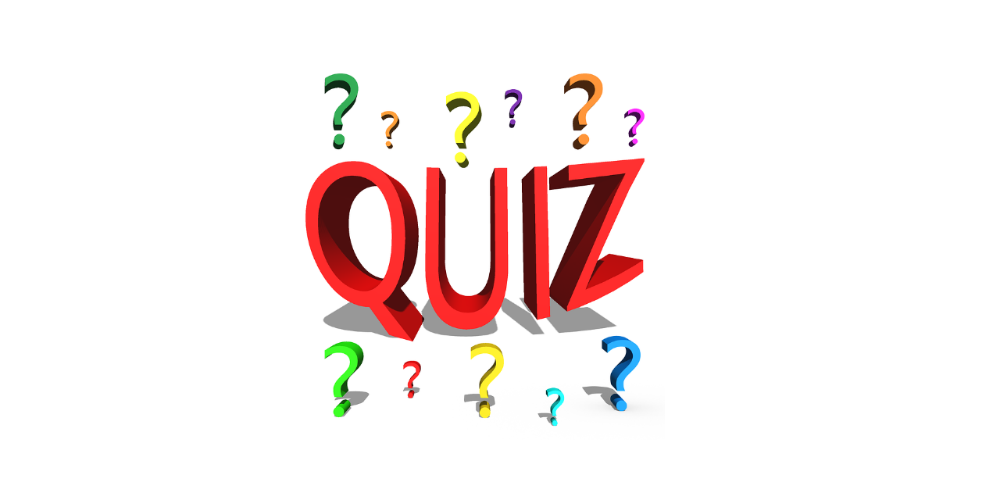

# Quiz  

Progetto iniziato mercoledì 11 dicembre 2019. 

## Componenti del gruppo

- Matteo Conti
- Davide Candalino
- Mattia Cantoni
- Davide Grasso

## Regole generali di funzionamento del progetto

Per sviluppare correttamente il progetto è necessario seguire con regolarità le attività presenti nella sezione *Issues*.
Le Issues (segnalazioni) sono suddivise in *Milestones* e ogni milestone ha una scadenza.
Inoltre nella sezione *Projects* vengono associate le issues a delle *Board*, che aiutano a registrare i progressi del progetto; è necessario mantenere aggiornate le board, segnando quando le issues vengono completate.
